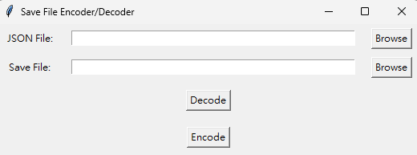

English | [繁體中文](README_TCH.md)
# Creator-of-Another-World-Save-endcode-decode
A save encoder and decoder of Creator of Another World.

# Update
Now it is pack into gui.

# How to use
> Notice: Before using tool please backup your save file.

> GUI
* Backup your original save file.
* Optional: select output json.
  * It is unnecessary but you can choose the output path you want.
  * If leave it with blank it will generate a json file.
* Select save file you want to edit.(Save file will be in save folder of the game)
* Click decode. It will generate a json content.
* After edit json file. Select the json file and save file you want to edit.
* Click encode.
  * Generate encode save file.
* Now it is done! Enjoy your save file.

# Working on...

# To-Do
- [X] Make a tutorial
- [X] Make it easy to use
- [X] Pack it to exe
