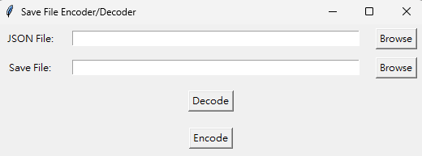
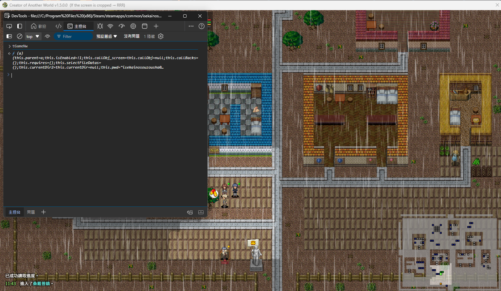

[English]((README.md)) | 繁體中文
# 異世界創造者存檔解密加密工具
一個幫助你加密解密異世界創造者存檔的工具。

# 更新
現在可以使用圖形化介面來使用！

可以在 Latest Release 中取得 exe 檔。

# 如何使用
> 注意：請在使用前備份存檔

### 圖形化操作(GUI)

1. **備份存檔**

2. **可選： 在 gui 上選擇一個 json 檔案來保存**
   - 這不是必要的，但還是能選擇想要的存檔路徑
   - 如果沒選擇檔案，會生成一個 json 檔

3. **選擇想要修改的存檔**
   - 存檔位置一般位於遊戲的 save 資料夾中。

4. **點擊 "Decode(解密)"**
   - 這會根據存檔來產生 json 內容

5. **根據需求修改 json 檔**

6. **在 gui 工具上選擇修改好的 json 檔和要修改的存檔**

7. **點擊 "Encode(加密)"**
   - 這會生成一個根據修改好 json 的存檔

8. **完成啦！享受全新的存檔**

### 筆記

- 使用前一定要備份原本的存檔
- 確定修改好的 json 是正確的格式

# 研究中...

# 待做
- [X] 製作教學
- [X] 讓它更好使用
- [X] 打包成 exe
